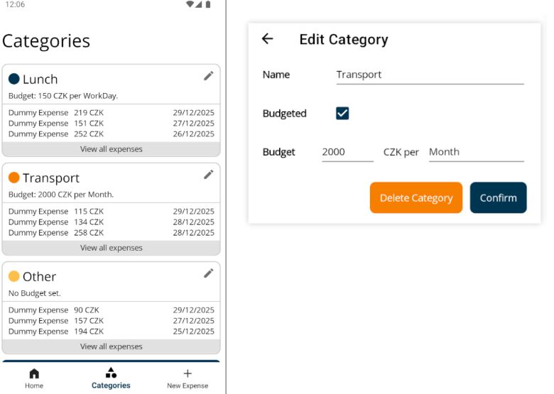
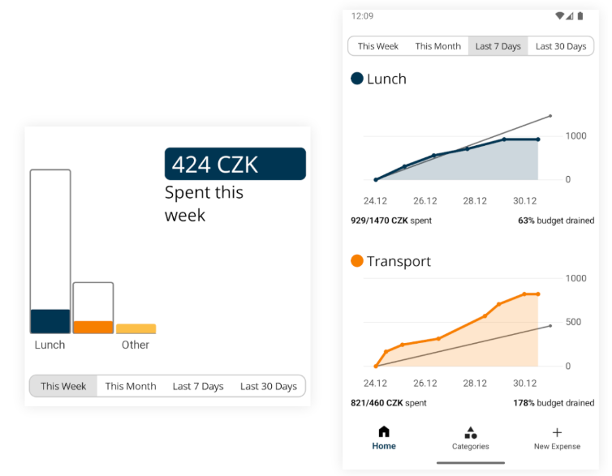
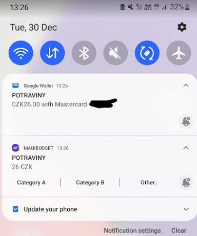

# Simple MAUI Budgeting app

Simple android-targeting budgeting app made with MAUI.

## Features

### Custom Categories

### Graphing of expenses based on selected timeframes

### Android: Automatic reading & parsing of google pay notifications

## Implementation details

- [LiveCharts2](https://livecharts.dev/) to plot expenses
- [LiteDB](https://github.com/litedb-org/LiteDB) to store data on-device
- Follows the MVVM design pattern through Bindings

## Missing features

- Dark mode support
- Multiple currencies
- Removal & edit of expenses